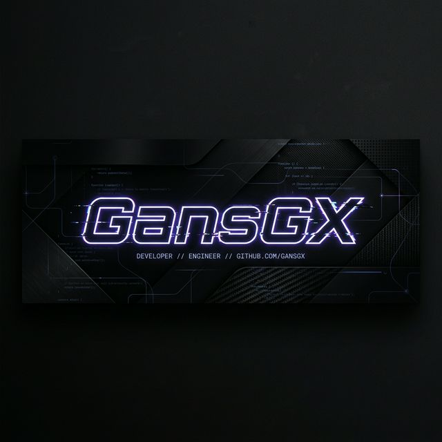

# Привет, я Вадим! 👋

### 🚀 О себе
Я начинающий **Frontend-разработчик**, который стремится к созданию идеальных интерфейсов и чистого кода. Мой фокус — современные веб-технологии и постоянное развитие в сторону Fullstack.

---

### 📊 Моя статистика

  
  

---

### 🛠 Стек технологий

#### **💪 Уверенно владею**

#### **📚 Изучаю / Сталкивался**

---

### 🗺 План развития на 3 месяца

#### **Месяц 1: Фундамент и Порядок** 🏗️
- [ ] **Ревизия репозиториев**: Добавление описаний, иконок и красивых README ко всем текущим проектам.
- [ ] **Главный проект**: Разработка серьезного React + TS приложения (например, таск-менеджер или дашборд).
- [ ] **Deep Dive**: Углубленное изучение паттернов в JS и React.

#### **Месяц 2: Рост и Visibility** 🚀
- [ ] **Backend Practice**: Написание своего API на Express + Postgres.
- [ ] **Open Source**: Первые контрибьюты в сторонние библиотеки.
- [ ] **Блог**: Написание статьи на Habr или VC про свой опыт "с нуля до React".

#### **Месяц 3: Профессионализм** 🏆
- [ ] **Архитектура**: Применение Clean Architecture в своих проектах.
- [ ] **Deployment**: Деплой Fullstack-приложения через Docker и Nginx.
- [ ] **Подготовка к собесам**: Решение задач на LeetCode и тренировочные интервью.

---

### 📬 Связаться со мной

  
  

---

🚀 *Спасибо, что заглянули!*
