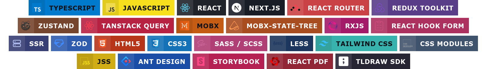
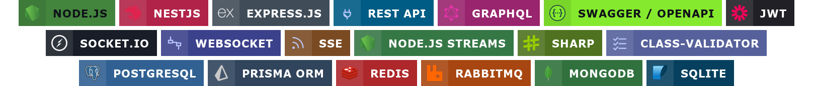
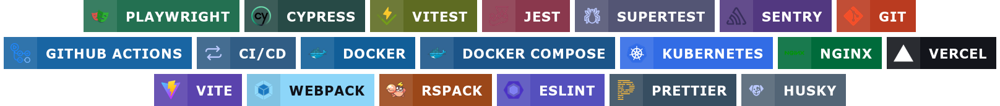
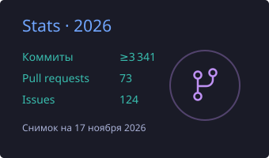

---

### ⚡ Инженерный стек

  <strong>🌐 Frontend Development &amp; UI</strong> 
  <picture>
    <source media="(max-width: 575px)" srcset="https://raw.githubusercontent.com/GANSGX/GANSGX/main/assets/skill-groups/frontend-mobile.webp">
    
  </picture>

  <strong>⚙️ Backend &amp; Databases</strong> 
  <picture>
    <source media="(max-width: 575px)" srcset="https://raw.githubusercontent.com/GANSGX/GANSGX/main/assets/skill-groups/backend-mobile.webp">
    
  </picture>

  <strong>🛠 DevOps, Cloud &amp; Tools</strong> 
  <picture>
    <source media="(max-width: 575px)" srcset="https://raw.githubusercontent.com/GANSGX/GANSGX/main/assets/skill-groups/devops-mobile.webp">
    
  </picture>

  <strong>🔒 Cybersecurity &amp; IT Infrastructure</strong> 
  <picture>
    <source media="(max-width: 575px)" srcset="https://raw.githubusercontent.com/GANSGX/GANSGX/main/assets/skill-groups/security-mobile.webp">
    
  </picture>

---

### 📌 Избранные проекты

  
  
  
  

---

### 📊 Статистика активности на GitHub

  
  

  

